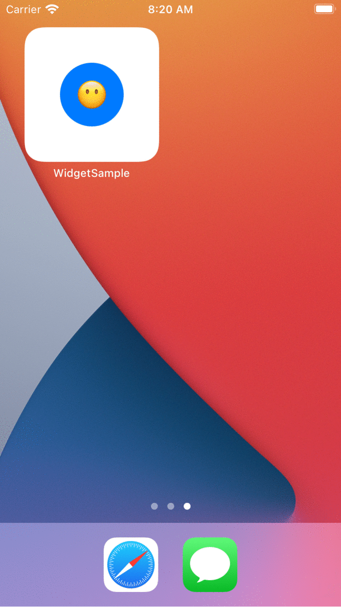

# swiftui-widget-sample

Most of the tutorial available online for implementing a SwiftUI Widget are all using an outdated version of the WidgetKit.

This repository reports few adjustments to the well-made tutorial of Kilo Loco, [Creating Your First SwiftUI Widget | iOS 14](https://www.youtube.com/watch?v=wOrkcdeui4U).

The only files that require adjustments in the tutorial are:

1) `Sexy_WidgetApp.swift` to trigger `WidgetCenter.shared.reloadAllTimelines()` when an emoji is tapped within the app. For some reason, the app in the tutorial keeps updating the widget whenever an emoji is tapped - this behaviour no longer works on WidgetKit.

2) `My_widget.swift` the placeholder is now part of the TimelineProvider together with `getSnapshot` and `getTimeline` replacing `timeline` and `snapshot` respectively.

  

### References

* [Apple Developer WidgetKit Framework](https://developer.apple.com/documentation/widgetkit#Overview) 
* [Apple Developer TimlineProvider Protocol](https://developer.apple.com/documentation/widgetkit/timelineprovider)
* [Apple Developer WidgetCenter Class](https://developer.apple.com/documentation/widgetkit/widgetcenter)